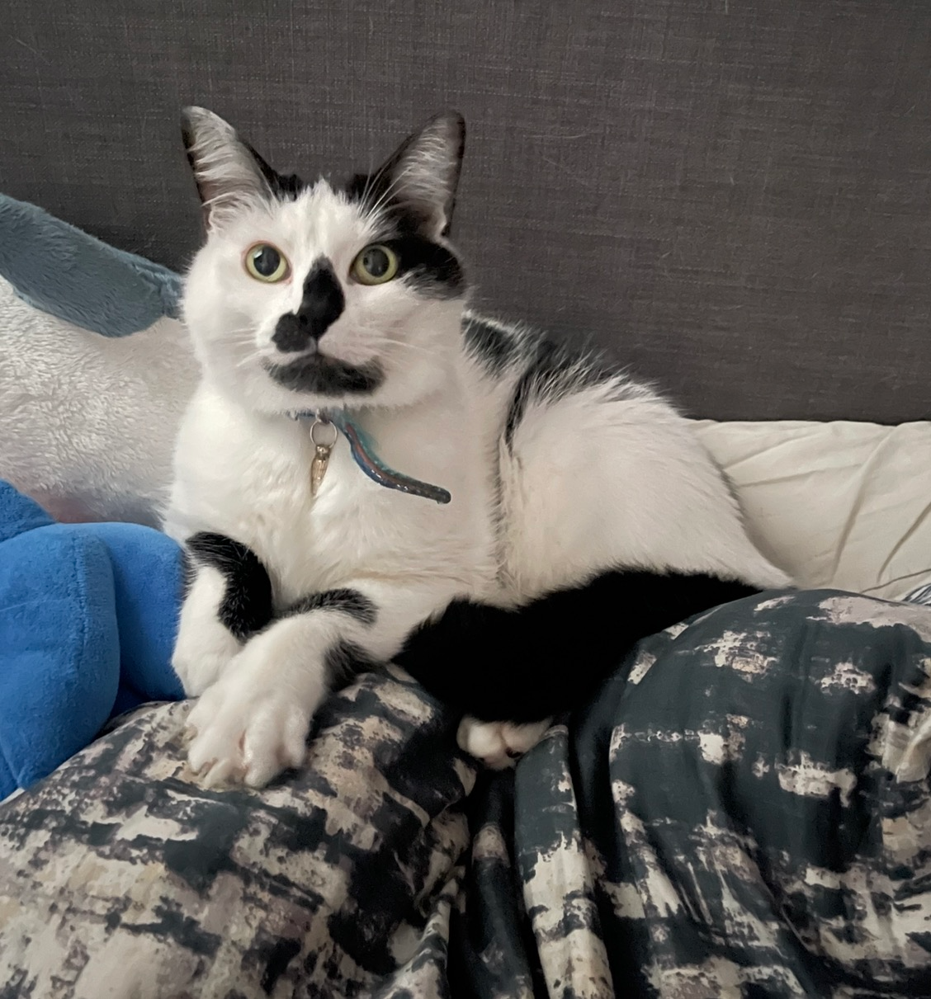

Hello! I'm **Cyril Ferlicot-Delbecque**, a research engineer living near Lille, France. I spend my days working on language evolution and software analysis, and my free time contributing to open source projects around [Pharo](https://pharo.org/).

## Work

I am currently a research engineer at [Inria](https://www.inria.fr/) in the [Evref](https://www.inria.fr/fr/evref) team, where I work on language evolution and software analysis. The job lets me touch many subjects: data manipulation and AI, language building, and static analysis to find vulnerabilities in software.

Before that:

- **CTO & co-founder** at Codaxis (2020–2023), building dynamic and interactive cartographies of information systems to reduce their maintenance cost.
- **R&D engineer** at Inria in the [RMoD](https://rmod.inria.fr/web/team) team (2018–2020), developing an IDE around software analysis and tooling for researchers and engineers.
- **R&D engineer** at Synectique (2015–2018), working on a suite for software management, maintenance, evolution and migration: parsers, models, meta-models and user interfaces.

I hold a MIAGE master (Master of Business Informatics) from the University of Lille, which I did through a pre-professional contract while working at Synectique. My journey started with an internship in the RMoD team in 2015, working on the Pillar project.

## Open source

I contribute to the [Pharo](https://pharo.org/) ecosystem since 2015. Pharo is a pure object-oriented programming language and a powerful live environment focused on simplicity and immediate feedback.

Projects I maintain or contributed to too many projects. You can explore my github or get in touch with me for more information. Here are some examples:

- [Pharo](https://github.com/pharo-project/pharo): A live and pur OO programming language and its IDE.
- [Material Design for Pharo](https://github.com/DuneSt/MaterialDesignLite): web components following the Material Design guidelines, on top of Seaside.
- [TinyLogger](https://github.com/jecisc/TinyLogger): a small but efficient logger for Pharo.
- [Chanel](https://github.com/jecisc/Chanel): an automatic code cleaner for Pharo code.
- [Moose](https://moosetechnology.org/): a platform for software and data analysis. 
- And many many others

## Beyond code

When I'm not in front of a screen, you'll find me listening to music, playing board and video games, reading, drawing, painting miniatures, doing embroidery or doing sport link climbing.

  
  

I share all of this with my two cats, Billy and Furry, who supervise everything I do:

  
  

## Contact

- Email: `cyril @ ferlicot.fr`
- Discord: `jecisc`

You can also find me on [GitHub](https://github.com/jecisc) and [LinkedIn](https://www.linkedin.com/in/cyril-ferlicot).
