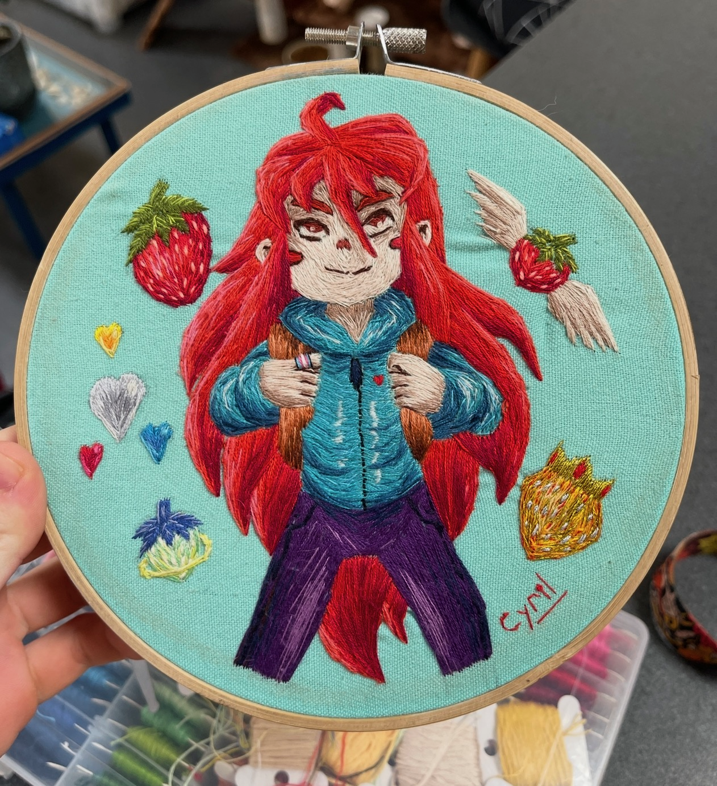
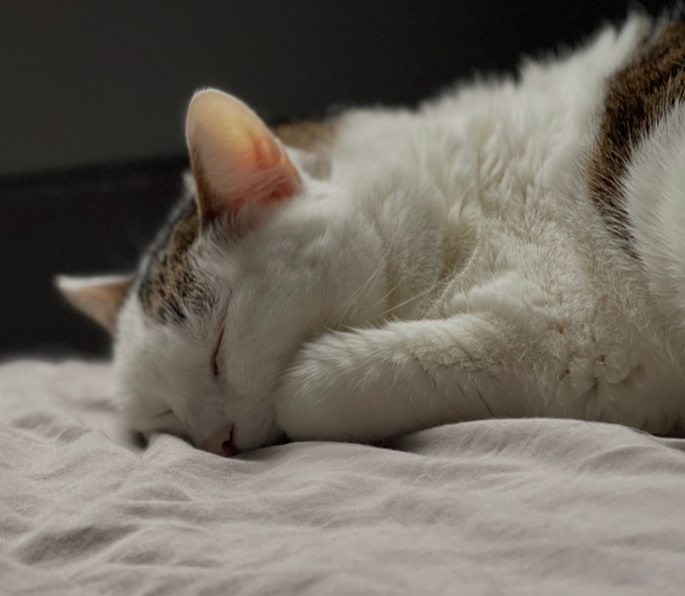

Hello! I'm **Cyril Ferlicot-Delbecque**, a research engineer living near Lille, France. At work (and on some of my free time :D), I tame legacy code, work on language evolution, software analysis and help improve the Pharo ecosystem — for more details you can check my page [CV](/cv/), and my open source work has its own [page](/open-source/). This page is for the rest of the story.

## Beyond code

When I'm not in front of a screen, you'll find me listening to music, playing board and video games, reading, drawing, painting miniatures, doing embroidery or climbing. You can see some of the miniatures I painted on [miniatures.ferlicot.fr](https://miniatures.ferlicot.fr).

  
  

I share all of this with my two cats, Billy and Furry, who supervise everything I do:

  
  

## Contact

- Email: `cyril @ ferlicot.fr`
- Discord: `jecisc`

You can also find me on [GitHub](https://github.com/jecisc)