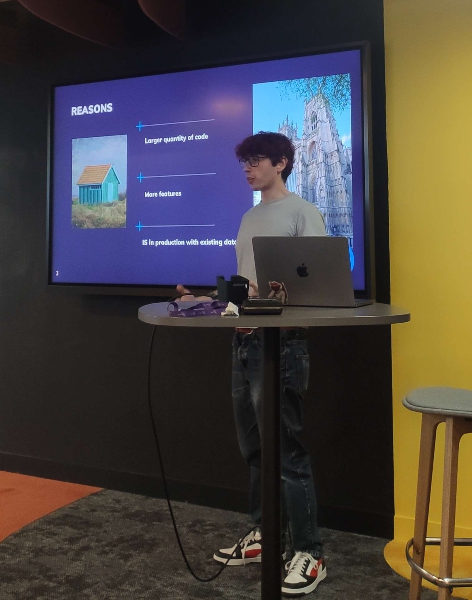

I love cleaning legacy code and reducing the technical debt of existing projects.

Research engineer living near Lille, France, specialized in software analysis and the Pharo ecosystem. The timeline below sums up my journey; my [about page](/about/) has the softer version and my contact details. You can also find more details on the open source projects I'm working on in the [open source page](/open-source/).

## Experience

Feb 2023 – Now

### Research Engineer @ [Inria](https://www.inria.fr/) — [Evref](https://www.inria.fr/fr/evref) team

Working on language evolution and software analysis through three successive missions:

- **Analysis of Python notebooks** *(current)* — mostly about AI. To do so, I implement Python importers for the Moose platform and algorithms such as control flow graphs (CFG), symbol resolvers and static single assignment (SSA).
- **Security, in the scope of the Software Heritage project** — finding new vulnerabilities in software based on CVEs. The goal was to find alternative paths to produce an attack from what was described in the CVE.
- **Pharo environment and its integration with AI**

Oct 2020 – Jan 2023

### CTO & Co-founder @ [Codaxis](https://codaxis.net/)

I co-founded the company. We built a solution of dynamic and interactive cartographies of information systems to reduce their maintenance cost. We also produced a system to have perennial documentation in an information system by automatically renaming entities in the documentation and warning the developpers if parts of the documentation was obsolete as soon as it became obsolete.

Oct 2018 – Sept 2020

### R&D Engineer @ [Inria](https://www.inria.fr/en/) — [RMoD](https://rmod.inria.fr/web/team) team

Working on software analysis. I developed an IDE around software analysis and created tooling allowing researchers and engineers to develop their own tools on the same subject.

Sept 2015 – Oct 2018

### R&D Engineer @ [Synectique](http://synectique.eu/)

I participated in the creation of a hands-on suite for software management, maintenance, evolution and migration: parsers, models, meta-models and user interfaces.

## Education

Sept 2015 – July 2017

### Master MIAGE — [University of Lille](http://fil.univ-lille1.fr/master-miage)

Master of Business Informatics done through a pre-professional contract while working at Synectique. I learned software engineering, management, information systems and project management.

Apr 2015 – Sept 2015

### Internship @ Inria — RMoD team

In charge of the improvement of [Pillar](https://github.com/pillar-markup/pillar). During this internship, I had the opportunity to present the project at the 2015 European Smalltalk User Group conference.

2012 – 2015

### Bachelor of Computer Science — University of Lille

Graduated with honors.

## Skills and Technologies

<h3>Skills</h3>

Software Analysis

Software Architecture

Object-Oriented Design

Legacy Code Refactorings

<h3>Programming Languages</h3>

Pharo / Smalltalk

Python

Java

HTML5 / CSS3

Vanilla JavaScript

<h3>Management</h3>

Project Management

## Languages

<strong>French</strong> — native

<strong>English</strong> — professional (TOEIC: 970/990)

## Hobbies

Music Board & video games Reading Drawing Miniature painting Embroidery Climbing

