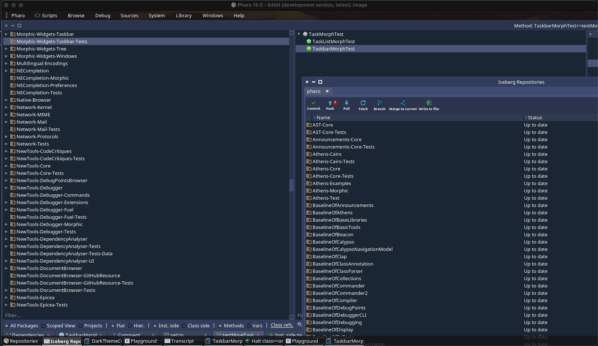
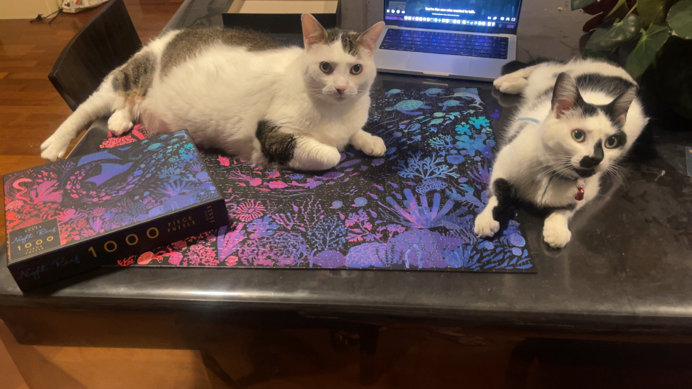

Some TODOs live in an issue tracker. Mine lived in the back of my head for over a decade:
*I want to be able to reorganize my windows in the Pharo taskbar.*

Since I started Pharo with Pharo 3, I wanted to reorganize my windows in the taskbar. But life happenes and drag and drop in Morphic is not really easy. I took the opportunity of trying agentic AIs to push this long awaited dream of mine!

  

## What you get

You can now grab any task in the taskbar and drop it where you want, with a visual indicator showing where the task will land. The order survives across sessions because, honestly, I like my windows in a specific order. The implementation even handles drops outside the taskbar's area.

## Current status

The pull request [pharo-project/pharo#19935](https://github.com/pharo-project/pharo/pull/19935) targets Pharo 15 and its tests are green (I mean the tests that were already green before I started my change :P). Following a discussion there, I am hoping it gets backported to Pharo 14 before its release, but I need to check with the release master before that.

And this might only be the beginning: I would love to add features like pinning applications to the taskbar, as we know them on other operating systems.

Feedback welcome — try it!

## Random ending

Also, on a totally random note, my cats are not really helping with puzzles :(

  

