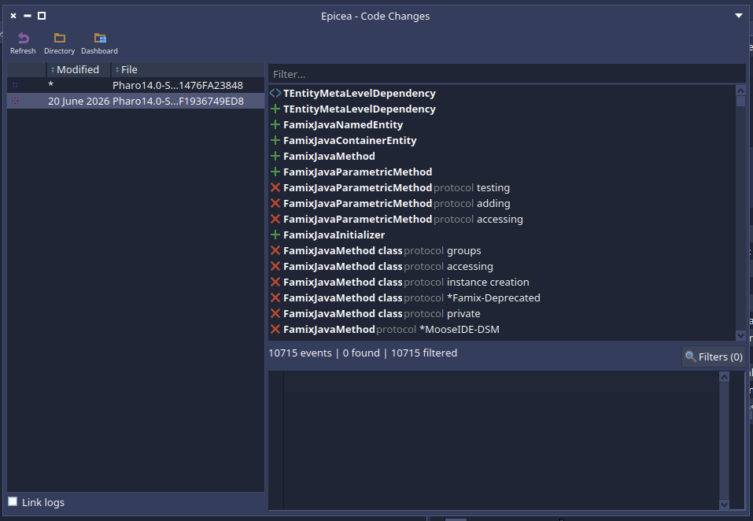
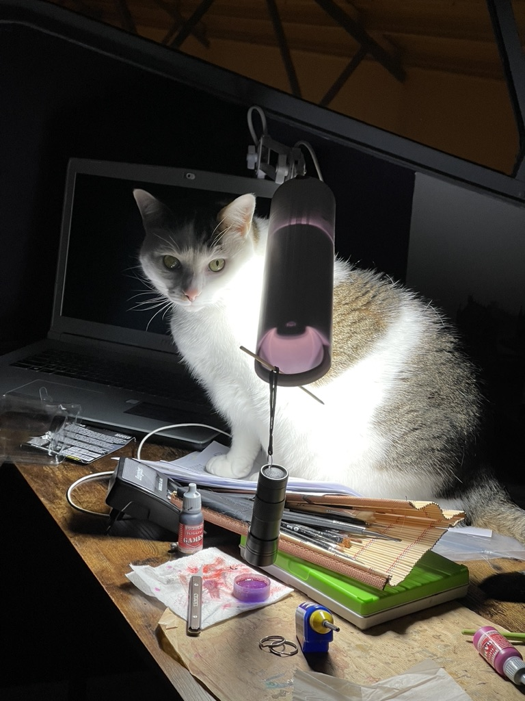

I am working on software analysis with the Moose platform. With is version 6, Moose revamped entirely its metamodels to base the new version on Traits and Slots in Pharo. But doing so, it pushed those features in uncharted territory because I do not know a single project pushing them so much. And this has consequences, we are the first one to get the bugs and performance bottlenecks :)

In this post, I'll describe how to update a Moose trait without having to take a break at the same time, and without having to give up on some tools such as Epicea ;)

## The problem

Traits are one of Pharo's nicest composition tools: they let you share behavior between classes without inheritance. But that reuse has a cost. When you modify a trait and need to recompile it, Pharo has to **rebuild the method dictionary of every user** of that trait. And if a trait is popular (in Moose, some traits have dozens of users and hundreds of methods), this rebuild happens again and again, over methods that mostly did not change.

Worse, while doing so, the system was announcing protocol changes that had nothing to do with reality. Tools were listening. And they were suffering.

To measure my progress I used a vanilla Moose image and added one slot to `TEntityMetaLevelDependency`, a trait sitting deep in the metamodel hierarchy with a lot of users. The result? **72 seconds**. For one slot.

Imagine when I was trying to load a branch that impacted multiple traits... It was way faster to put my image in the bin and create a new with the latest code directly!

On top of this, we announced some wrong announcements such as:
- ClassAdded
- ProtocolRemoved
- ProtocolAdded

This was flooding some tools such as Epicea that ended up with hundres of thousands of wrong entries, making it unusable!

  

## 3 steps to improve the situation

### 1. Stop announcing protocol changes during rebuild ([PR #19801](https://github.com/pharo-project/pharo/pull/19801))

Rebuilding a method dictionary is an internal operation. It should be silent. But when a trait had slots, or when method source code needed adapting (aliases, renamed slots), the rebuild announced protocol changes for the impacted methods.

Announcements are not free, and tools react to them:

- [Epicea](https://github.com/pharo-project/epicea) (the change recorder) registered bogus events. In Moose this made Epicea unusable really fast.
- The whole thing made an already-slow operation even slower.

With those announcements silenced during the rebuild, the benchmark went from 72 seconds to **57 seconds**.

This PR has been integrated in Pharo 14 and backported to Pharo 13.

### 2. Fix wrong announcements during recompilation ([PR #19841](https://github.com/pharo-project/pharo/pull/19841))

Digging deeper, `ProtocolRemoved` was wrongly announced whenever we recompiled a class or a trait using traits. Same family of consequences, sometimes worse:

- Iceberg went dirty for nothing,
- Epicea recorded incorrect events (and became unresponsive easily),
- and of course recompilation paid the price too.

This PR also fixed a subtle one: the original package tag of classes got lost during recompilation, causing bogus `ClassAdded` announcements. Keeping the package tag means that interrupting a class recompilation midway no longer loses your package.

This PR has been integrated to Pharo 14. It is harder to backport it, I don't know if I'll get the time to do this anytime soon.

### 3. Rebuild method dictionaries in one pass ([PR #19870](https://github.com/pharo-project/pharo/pull/19870))

This is the big one, currently under review for Pharo 14.

To install the methods of a trait into its users, the system iterated over the selectors of the *trait composition* and installed a copy of each method in the user — and it did so multiple times, traversing the same composition again and again. Once to get the selectors. Once to get the original trait. Once to get the previous compiled method. Once to get the protocol. Once to get the source code to recompile.

The new approach builds a **compilation info object** containing everything needed upfront, so the trait composition is visited once instead of many times. On top of that, most of the remaining time was spent recompiling the methods of users with slots; installation itself is comparatively cheap, so the PR focuses the effort where the time actually goes.

Result: 72 seconds down to **27 seconds**.

## The score so far

| Step | Adding a slot to `TEntityMetaLevelDependency` |
|---|---|
| Vanilla Moose image | 72 s |
| #19801 — silent protocol rebuild | 57 s |
| #19870 — single-pass rebuild | 27 s |

That is roughly **2.7× faster**, and the image stays usable while tools like Epicea no longer choke on phantom events.

There might still be a few things to squeeze around the recompilation itself, and I might explore them later. If you maintain code that uses large traits, keep an eye on [#19870](https://github.com/pharo-project/pharo/pull/19870): reviews welcome!

## And after that?

In order to get bellow 27sec, we need to reduce the time it takes to recompile methods of stateful traits. This is needed because if the index of a slot change, the code source needs to be updated to access the right slot. 

I discussed with people and we have 3 ideas in order to improve this.

The first idea is about object headers. For now we store info only in 32 bits of object headers because Pharo still runs on 32bits system. An idea would be to use one of the remaining 32bits when we are on a 64bits system to store the info: does my method accesses a slot? This could speed up the rebuild since we could skip the recompilation of all stateless methods. And almost no one develops in 32bits.

A second idea would be to let the compiler generate silently a hidden getter and setter for all slots. And it would compile accesses as a message send to those methods. Like this, we would have only 2 methods by slots to recompile. And they are tiny methods. The problem is that we would probably need to update the VM and all the tooling to hide those methods.

A third option would be to add a new feature to the compiler: realign slots. Instead of recompiling, the compiler would just update the indexes of slots accesses to spend less time in this operation.

We have ideas but I'll probably not have the time to work on this sadly. But x2.7 is already a nice step :)

## Random ending

Once again, I'm ending this post with a picture of one of my cats because, why not? Look, he's ready to give you a secondary quest!

  

