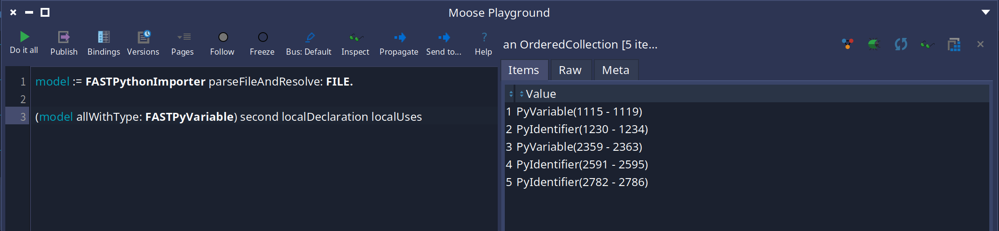
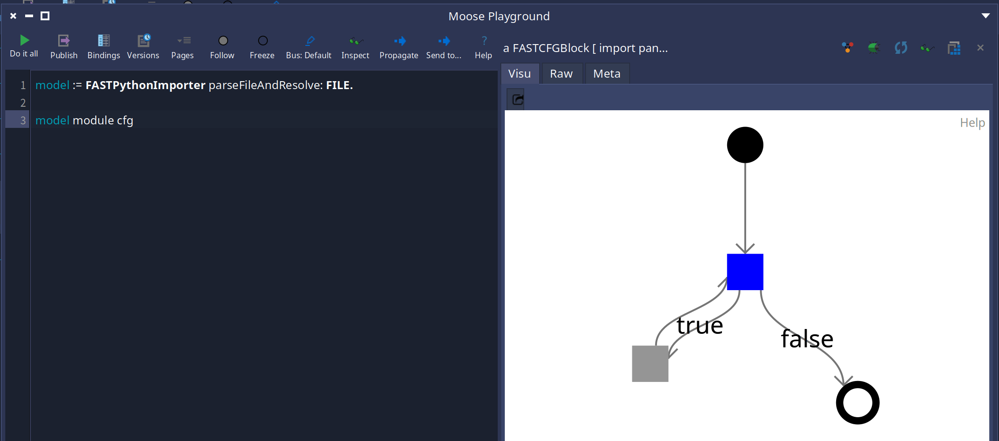

Moose is a platform for software analysis. To analyze a program, Moose needs a model. We have two kinds of models: **Famix** models that represent the entities and dependencies of a software system, and **FAST** models that represent the AST of a program.

<div class="centered-figure">
  
</div>

Over the past months I have been working on **FAST-Python**: a complete toolkit to import, resolve, and analyze Python code in Moose. The project currently has more than 1300 tests to make sure everything works as expected.

## The Python Importer

Everything starts with importing Python source code into a FAST model. The importer parses Python files and produces a `FASTPyModel` containing the full AST. It supports importing entire projects or single snippets:

```smalltalk
model := FASTPythonImporter parseFileAndResolve: aFileReference.
```

The `parseAndResolve:` variant also runs the local resolver and SSA on the imported code, which is what most analyses need.

## The Local Resolver

Raw AST nodes do not know what they refer to. Is `x` in `print(x)` the same `x` as the one assigned three lines above? The **local resolver** answers that question.

`FASTPythonLocalResolverVisitor` walks the AST and links each named entity to its first declaration. Once resolved, you can ask any node for its `#localDeclaration` to find where it was declared, and `#localUses` to find every place that refers to the same declaration.

<div class="full-width-figure">
  
</div>

Python makes this tricky because anything named can shadow anything named — a variable can be shadowed by an import, which can be shadowed by a function, all in the same file. The resolver tracks these chains via `#shadowedBy` and `#shadowing` links, keeping each declaration's uses independent.

## The SSA Resolver

The local resolver tells you *what* a name refers to, but not *which assignment* is responsible for a particular use. That is what the **SSA (Static Single Assignment)** provides.

`FASTPythonSSAVisitor` builds a SSA form of the AST. After resolution, every variable use knows exactly which assignment(s) can impact its value. When a variable can receive values from multiple assignments (for example, inside different branches of an `if`), the SSA creates a **Phi version** that groups all possibilities.

<div class="full-width-figure">
  
</div>

```smalltalk
"Where does this use of x come from?"
lastPrint := model module statements last arguments first.
lastPrint ssaVersion.        "Phi(x_2, x_3) — two possible assignments"
lastPrint versionWriteAccesses. "the two writes that can reach this use"
```

This enables powerful queries: what expressions are assigned to a variable? What is the *transitive* assignment chain? Which reads are reachable from which writes?

## The Control Flow Graph

FAST-Python also builds a **Control Flow Graph** for behavioral entities (modules, functions, methods, lambdas, classes). The CFG represents all possible execution paths through the code.

<div class="full-width-figure">
  
</div>

```smalltalk
FASTPythonCFGVisitor buildCFGOf: aFunctionDefinition.
```

The CFG is built using a dedicated visitor that walks expressions and next blocks, visiting each conditional branch independently. It is used internally by the SSA resolver and is also available for custom analyses.

## The Analysis API

On top of all of this, FAST-Python provides an API to answer real analysis questions about Python software. Here are a few examples:

**Where is a variable written?**

```smalltalk
lastPrint ssaVersion versionWriteAccesses.
"the writes that can impact this specific use"
```

**Where is a variable read?**

```smalltalk
lastPrint versionReadAccesses.
"every read reachable from this SSA version"
```

**What expressions are used to assign a variable?**

```smalltalk
lastPrint assignedExpressionsMap.
"a Dictionary(mapping each write access to its assigned expressions)"
```

**What are the transitive assignments?**

```smalltalk
lastPrint transitiveAssignedExpressionsMap.
"follows variables in assigned expressions recursively"
```

**Which calls are made on a variable?**

```smalltalk
variable callsOnVariable.
"only calls where the variable is the receiver, e.g. x.append(1) or x()"
```

Each of these queries works at different granularity levels — you can ask about all accesses of a variable, or only the ones reachable from a specific SSA version.

## Limitations

The current implementation has known limitations:

- **Attribute accesses** like `x.y.z = 3` followed by `a = x.y; print(a.z)` are not fully resolved — the link through the intermediate variable is missing.
- **Subscript comparisons** use string matching, which means `x[0:4]` and `x[:4]` are not recognized as equivalent.
- **Instance variables** cannot be tracked by the SSA since Python has no explicit declarations and method call order is unknown.
- **Python 2** scoping rules (e.g. list comprehension variable leaking) are not supported — the resolver targets Python 3 behavior.

## Conclusion

FAST-Python is actively being used to answer real analysis questions on Python codebases. The combination of local resolution, SSA, and the CFG gives us a solid foundation for data-centric analysis. 

The full documentation is available in the [FAST-Python repository](https://github.com/moosetechnology/FAST-Python/blob/main/resources/doc/analysis.md).

I had a very attentive supervisor reviewing every commit on this project.

<div class="centered-figure">
  
</div>
